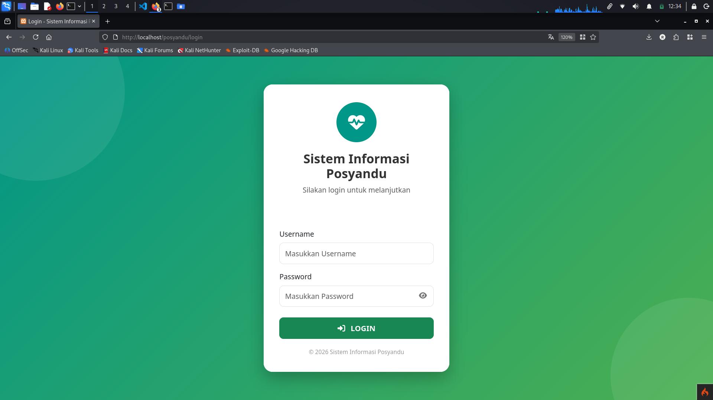
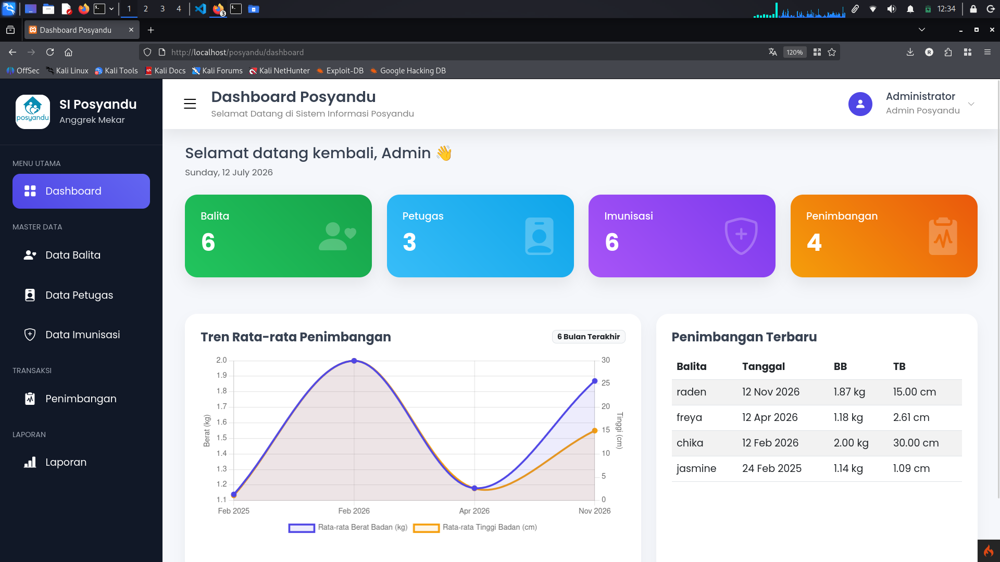
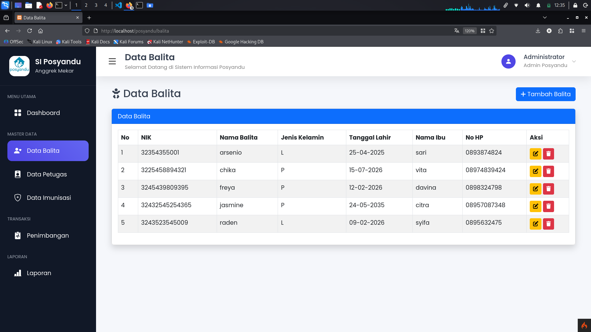
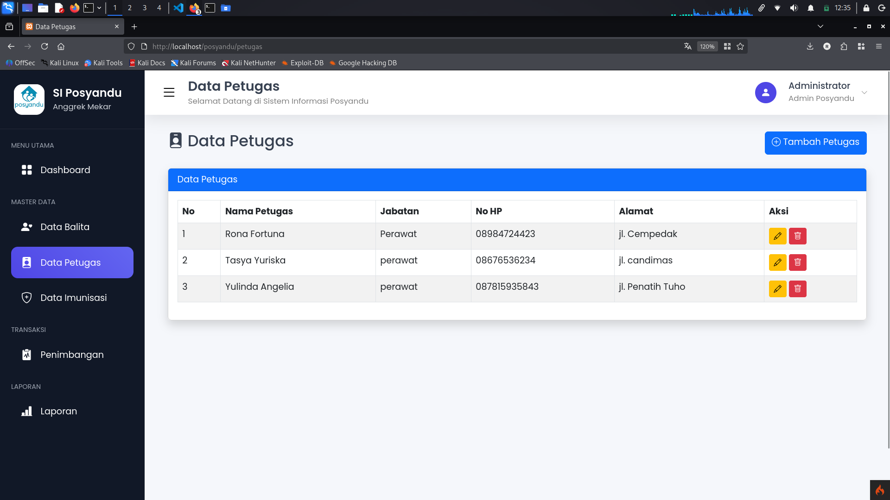
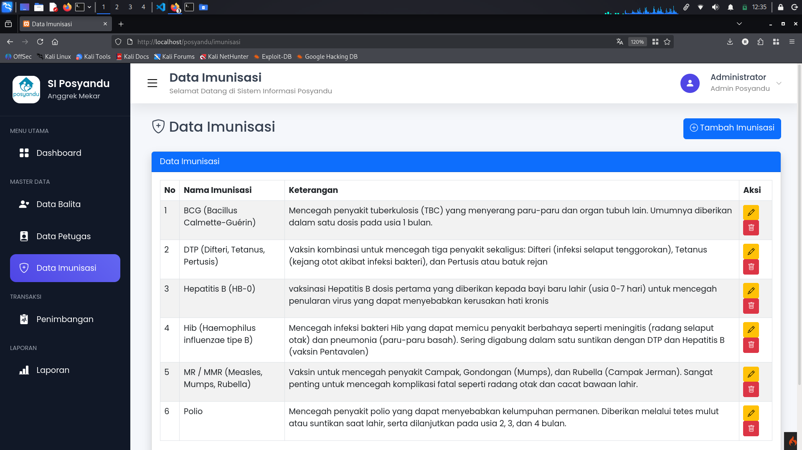
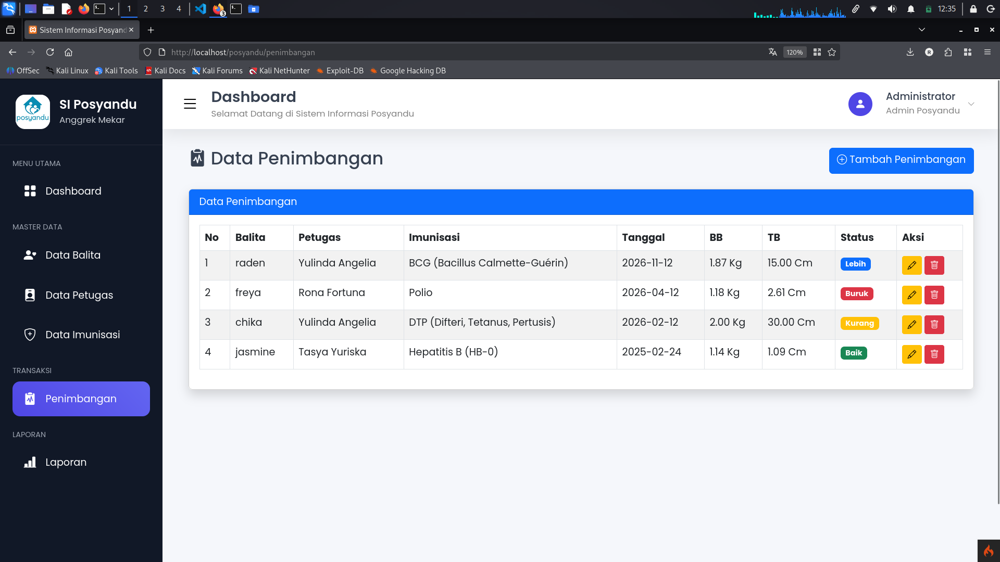
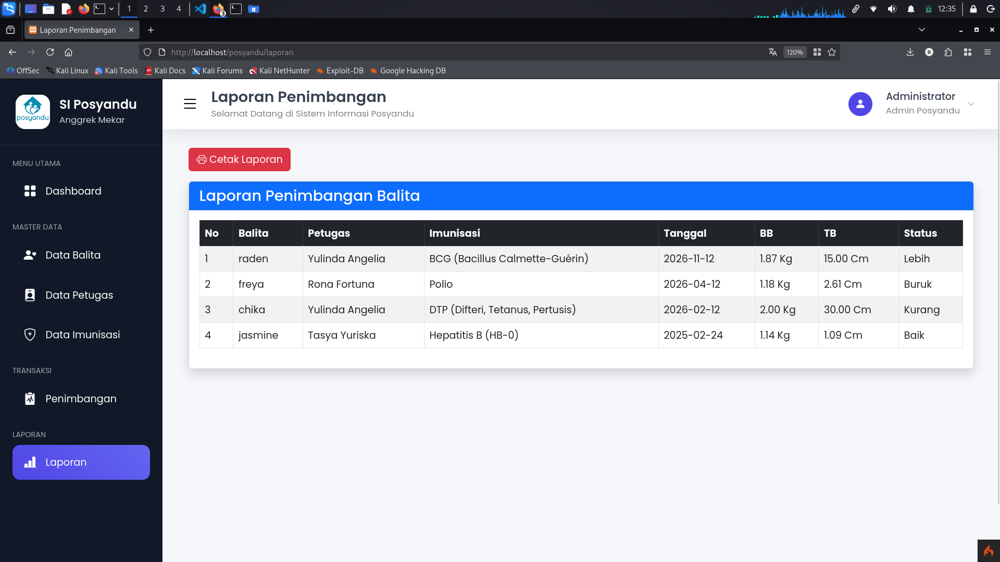

# SI Posyandu - Sistem Informasi Posyandu

Aplikasi web sederhana berbasis **CodeIgniter 4** untuk mengelola data balita, petugas, imunisasi, dan penimbangan di Posyandu.


## 📸 Screenshot

<!-- Ganti dengan screenshot asli tampilan aplikasi kamu -->
| Login | Dashboard |
|---|---|
|  |  |

| Data Balita | Data Petugas |
|---|---|
|  |  |

| Imunisasi | Penimbangan |
|---|---|
|  |  |

| Laporan |
|---|
|  |

## ✨ Fitur

- **Autentikasi** — login untuk admin/petugas
- **Dashboard** — ringkasan data (jumlah balita, petugas, imunisasi, penimbangan) dan grafik tren rata-rata penimbangan
- **Data Balita** — tambah, lihat, ubah, hapus data balita
- **Data Petugas** — tambah, lihat, ubah, hapus data petugas
- **Data Imunisasi** — pencatatan imunisasi balita
- **Penimbangan** — pencatatan berat badan & tinggi badan balita per periode
- **Laporan** — cetak rekap data posyandu

## 🛠️ Tech Stack

- **Framework**: CodeIgniter 4
- **Bahasa**: PHP 8.2+
- **Database**: MySQL/MariaDB
- **Frontend**: HTML, CSS, JavaScript, Chart.js (grafik tren penimbangan)

## 📋 Kebutuhan Sistem

- PHP 8.2 atau lebih tinggi
- Composer
- MySQL/MariaDB
- Ekstensi PHP: `intl`, `mbstring`, `json`

## 🚀 Instalasi & Menjalankan Project

1. **Clone repository**
   ```bash
   git clone https://github.com/rik0sec/si-posyandu.git
   cd si-posyandu
   ```

2. **Install dependency**
   ```bash
   composer install
   ```

3. **Konfigurasi environment**
   ```bash
   cp env .env
   ```
   Lalu buka `.env` dan sesuaikan bagian berikut:
   ```
   app.baseURL = 'http://localhost:8080/'

   database.default.hostname = localhost
   database.default.database = db_posyandu
   database.default.username = root
   database.default.password =
   database.default.DBDriver = MySQLi
   ```

4. **Buat database**

   Buat database baru dengan nama `db_posyandu` di MySQL, lalu import struktur tabel:
   ```bash
   mysql -u root -p db_posyandu < app/Database/db_posyandu.sql
   ```

5. **Jalankan server**
   ```bash
   php spark serve
   ```
   Buka `http://localhost:8080` di browser.

## 🔑 Akun Default (Login)

Setelah import database, gunakan akun berikut untuk login pertama kali:

| Username | Password |
|---|---|
| `admin` | `admin123` |

> ⚠️ Disarankan untuk mengganti password setelah login pertama kali, terutama jika project ini digunakan lebih lanjut (bukan sekadar demo/tugas).

## 📁 Struktur Project (ringkas)

```
app/
├── Controllers/
│   ├── Auth.php              # Login
│   ├── Dashboard.php         # Halaman utama
│   ├── Balita.php            # CRUD data balita
│   ├── Petugas.php           # CRUD data petugas
│   ├── Imunisasi.php         # Pencatatan imunisasi
│   ├── Penimbangan.php       # Pencatatan penimbangan
│   ├── Laporan.php           # Laporan
│   └── Home.php
├── Models/
│   ├── M_balita.php
│   ├── M_petugas.php
│   ├── M_imunisasi.php
│   ├── M_penimbangan.php
│   └── M_user.php
├── Views/
│   ├── auth/                 # Halaman login
│   ├── dashboard/            # Halaman dashboard
│   ├── balita/                # Halaman data balita (list, tambah, edit)
│   ├── petugas/               # Halaman data petugas
│   ├── imunisasi/             # Halaman data imunisasi (list, tambah, edit)
│   ├── penimbangan/          # Halaman data penimbangan
│   ├── laporan/               # Halaman laporan (index, cetak)
│   ├── layout/                # Layout bersama (header, navbar, sidebar, footer, template)
│   └── errors/
└── Database/
    └── db_posyandu.sql       # Struktur database
```

## 👤 Author

**Riko Nugroho** - 2459201107

## 📄 Lisensi

Project ini dibuat untuk keperluan tugas/pembelajaran.